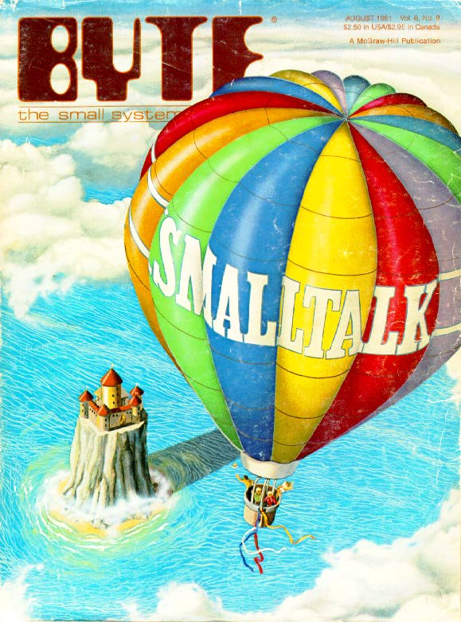
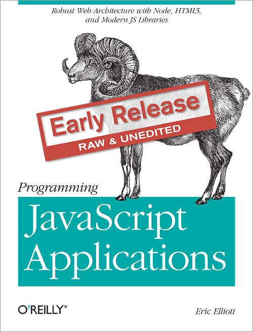

!SLIDE
.notes queue up video
.notes queue up Self w/ Demo snapshot
<link rel="stylesheet" href="style.css" type="text/css"/>

# Self Discovery:
## Looking for insight in JavaScript's esoteric roots

!SLIDE
# Hello!
- Jonathan Mukai-Heidt
- Senior Software Engineer at PINCHme
- @johnnymukai / johnnymukai@gmail.com
- Terrible JavaScript programmer

!SLIDE
I'm kidding a little about being a terrible JavaScript programmer, but sometimes I'm really blown away by JavaScript.
I'm really excited to be giving this presentation here in Beijing.
I started programming JavaScript back in 1998 or 1999.
Back then, JavaScript was this little thing you would use to make a menu pop up or annoyingly move parts of the DOM around.
TODO: (pick) A lot of the people in this room may not remember but back in the 90s we were writing exceptionally simple
DOM manipulations in JS and that was *it*
It was legendarily implemented in an exceptionally short time, and people really thought it would go the way of the buffalo.
They thought that Java in the browser or Flash was the way things were going.
I remember when Google started using AJAX in search results and it blew my mind.

That was back in the late 90s, early 2000s. Now I have reason to be blown away again.
I went through a period where I wasn't programming any front-end stuff or I was writing very little of it anyway.
In the past three years or so I've gotten back into it and I can't believe how far the community and the libraries have come -- to make no mention of node.
I tell people I feel like Rip van Winkle. Or maybe a more appropriate story is Rinkan
TODO: look that shit up
I went up into the mountains and now that I've come back down, JavaScript has taken over!
TODO(cut?) It's difficult to express just how astoundingly far JavaScript has come.

!SLIDE
Anyway, I hope the reason for bringing up my own rambling backstory will make sense in a minute.
What I'd like to do today is give you all a bit of a history lesson.

!SLIDE
TODO! this is a candidate slide I guess
What are we going to talk about today?
So it's a bit of a history lesson.
But there are lessons in here about our contemporary use of JavaScript as well.
And even more than that I hope to inspire some curiosity about some big ideas of the past that are still very relevant today.
TODO! Here is where you talk about aims of the talk
There's a lot of fascinating history here.

# Self
.notes brief five second intro to self
.notes it influenced JS and its interesting
What I'd like to talk about today is Self.
Self was and still is an ambitious and wholly unique language that had a very strong influence on JavaScript.

!SLIDE
TODO: aims of the talk
There's a lot of fascinating history here, which I think is interesting enough to warrant a talk on its own.
But there's also a lot of lessons to be learned from Self.
I hope that after this talk you'll be able walk away not just with a greater sense of JavaScript's place in programming history,
but also with some practical lessons.
And most importantly, a little inspiration.

!SLIDE
So how did I come to be interested in Self?

!SLIDE
# JavaScript is a unique language
.notes There are a lot of things about JavaScript that make it different from other languages.

!SLIDE code
// Objects are a collection of slots

record = {};
record.artist = "Jim Carrol";
record.title = "Catholic Boy";
record.play = function(){
  //...
};

.notes we can just add these slots on at will, and they can hold both values and functions.

!SLIDE code
// Functions are callable objects
// with properties

var timesCalled = function timesCalled(){
  times.calls = times.calls || 0;
  times.calls++;
  return times.calls;
};

timesCalled() // => 1
timesCalled() // => 2

// (a poor example but it serves my purposes)

!SLIDE
// Functions really are special in JS
// Just look at jQuery AJAX callbacks
$.ajax({
  success: function() {
    alert("Great success!");
  },
  failure: function(){
    alert("Oh noes!");
  }
})

!SLIDE code
// Inheritance through prototypes...

// alert('fill me out!');
TODO!(see 3 types of prototypal OO)

!SLIDE
# Every wonder where these ideas came from?

!SLIDE
# I wondered!
A few years ago when I got back into doing web work, I was and still am mostly doing Rails.
This was when Coffeescript was brand new and it was big news that it had been pulled into Rails as a default.
Now this surprised me because even though I think Coffeescript is cool, in all this discussion about it people were really harping on Javascript.
When people griped about JavaScript back in the early 2000s, they were just misguided, I thought.
They hadn't seen what you could do in the browser with AJAX.

!SLIDE
But now the arguments I'm hearing about JavaScript are about its strange inheritance mechanisms.
I'm noticing a big thing that people are pushing in Coffeescript is this class wrapper it gives you on top of native JS inheritance.

!SLIDE
# However!
.notes The thing is, as full of land mines as JavaScript is, and as much as some of my colleagues like to malign it,
.notes JavaScript is pretty fun.
.notes Deep down I know Mr. Eich must be a pretty smart guy, because for all its warts, there's something about JavaScript
.notes that I just can't put my finger on that makes it really fun.
TODO: And you must remember, it's true that JavaScript was initially written in a shockingly short period of time, but
Brendan Eich was doing 

!SLIDE
So I started looking into JavaScript's influences.

!SLIDE
# FP and Scheme
I found that Scheme's influence had gotten a lot of attention lately.
.notes this influece has gotten a lot of attention
.notes at least in the circles I'm familiar with

!SLIDE
# Raganwald

!SLIDE
# JavaScript's approach to OOP
.notes but I was really curious about JS's
.notes unique approach to OOP
.notes there's just some features there that you don't find elsewhere

!SLIDE
# Where from?
.notes where did those features mentioned earlier come from?
I wanted to know where these ideas came from.

!SLIDE
# Another influential language
.notes besides Scheme
.notes As Eich was working on LiveScript, soon to be called JavaScript another programming language was making waves.
.notes It was meant to be the successor to Smalltalk, the next big OOP thing.

!SLIDE
TODO: talk more about Java in the browser and browser wars etc

!SLIDE
TODO: break this up
Self
====

  .lefty SELF is an object-oriented language for exploratory programming based on a small
  number of simple and concrete ideas: prototypes, slots, and behavior. _Prototypes_ combine inheritance
  and instantiation to provide a framework that is simpler and more flexible than most object-oriented
  languages. _Slots_ unite variables and procedures into a single construct. This permits the inheritance
  hierarchy to take over the function of lexical scoping in conventional languages. Finally, because
  SELF does not distinguish _state from behavior_, it narrows the gaps between ordinary objects,
  procedures, and closures. SELF’s simplicity and expressiveness offer new insights into objectoriented
  computation.

  (_Emphasis mine_)

  Self: The Power of Simplicity, Ungar and Smith, 1991

.notes this is kinda like BAM! SELF
.notes do you want to intro Borning et al more
.notes or is this a good transition?

!SLIDE
# Sounds familiar right?

!SLIDE
# Where did _these_ ideas come from then?
.notes We can get into Self's influence on Javascript in a minute, but let's take some time
.notes to talk about the forces that brought about Self.

!SLIDE
# Let's set the stage
It is the 1980s and Smalltalk is king.

!SLIDE fullpage

!SLIDE
Smalltalk
=========
- THE OOP language
- Alan Kay, Xerox PARC
- Hugely popular, hugely influential

!SLIDE
Smalltalk
=========
- Managed environment
- message passing (from Simula)
- meta/eigenclasses
- "Everything is an object"

!SLIDE
Smalltalk
=========
- major ideas like "everything is an object" are present in Ruby, Python
- syntax influence on Objective C

.notes this "legacy slide" could use some love maybe?

!SLIDE
# So how was Self trying to improve on this?
.notes As early as 1986, six years after Smalltalk
.notes people are already noticing some problems with classical OOP

!SLIDE
# When designing a new object, one must first move to the abstract level of the class, write a class definition, then instantiate it and test it, rather than remaining at one leve, incrementally building an object.

  (from A. Borning "Classes versus Prototypes in Object Oriented Languages", 1986)

.notes this is something we completely take for granted in Javascript with object literals
.notes he goes on to talk about meta-classes and the difficulty this presents new learners
.notes (maybe expand here)

!SLIDE
# The emphasis on classes in the programmer's interface is at odds with the goal of interacting with the computer in a concrete way.

  (Borning, continued)

!SLIDE
# For an object to have a distinct message protocol, a separate class must be created for it.

  (Borning, continued)

TODO: talk about Eigenclass
TODO: talk for real about the issue of Singletons

!SLIDE
# Enter the 90s and Self
.notes this was the void Self was trying to fill
.notes Self was to be the next Smalltalk
.notes the next step in the evolution of OOP

!SLIDE
# The original Self video

!SLIDE
# Programming as experience

!SLIDE
# Intuitive concreteness of the object

!SLIDE
# No distinction between running and editing a program

!SLIDE
# These were heady times

!SLIDE
# Demo of a Self program?

!SLIDE
# So this was the state of OOP when Eich was developing JavaScript

!SLIDE
# Some practical notes

!SLIDE
# ...Or "What I learned while researching Self"

!SLIDE
# I thought this talk would be about Prototypes vs. Classes
.notes makes sense right?
.notes people arguing over JS's shitty inheritance etc
.notes I was coming from the Ruby-school of OOP
.notes Where Coffeescript was this saving grace that was going to fix the weird OOP of Javascript
.notes And I thought I'd be really digging and looking for an argument

!SLIDE
# Prototypes have already been embraced
.notes I found there wasn't really an argument for prototypes that
.notes hadn't been argued
.notes But there are some really smart programmers out there, people way smarter than me,
.notes Who are already making this argument.

!SLIDE
# Douglas Crockford
  

!SLIDE
# Douglas Crockford
  .lefty Five years ago I wrote Classical Inheritance in JavaScript. It showed that JavaScript is a class-free, prototypal language, and that it has sufficient expressive power to simulate a classical system. My programming style has evolved since then, as any good programmer's should. I have learned to fully embrace prototypalism, and have liberated myself from the confines of the classical model.

  http://javascript.crockford.com/prototypal.html (from 2006)

.notes 2006, yikes!

!SLIDE
# Eric Elliot
  

!SLIDE
# Eric Elliot
  Classical Inheritance Is Obsolete – How To Think In Prototypal OO

  http://ericleads.com/2013/06/classical-inheritance-is-obsolete-how-to-think-in-prototypal-oo/

!SLIDE
# Eric Elliot
  https://github.com/dilvie/stampit

.notes (see, I'm not SO late to the game!)

!SLIDE
# Maybe I'm preaching to the choir
.notes Programmers who use Javascript extensively probably know way more about prototypes than I
.notes Object literals in callbacks
.notes The power of prototypes are having a basic object at hand at all times.
.notes Polymorphism for reals - you don't have to figure out what a chair is to implement a bench, as long as they respond to
.notes sit() // or whatever

!SLIDE
# But I shouldn't have been surprised
.notes Reading all the literature from Borning up to Ungar and Smith they all raise the question
.notes Do we need classes? Are prototypes supposed to replace classes?

!SLIDE
# Contemporary JavaScipt is this hypothesis made manifest
.notes In the 90s this was just a question
.notes But they made this assertion, basically "If classes are important, programmers will make them."
.notes Basically, classes aren't bad, they just aren't necessary for everything a programmer does.
.notes Prototypes are more basic, and since we can implement classes with prototypes, let's experiment with making
.notes this more basic component available to the programmer.

!SLIDE
# JavaScript is dynamic enough for us to implement whatever kind of inheritance we want
.notes Setting aside the `new` keyword and constructor functions, programmers implemented the class interface they wanted
.notes So in a sense contemporary Javascript programming answers, in the practical every-day application world,
.notes many of these questions.
.notes TODO
.notes And they were right! Classes are the right tool for the job, but prototypes are more flexible. As we've needed classes,
.notes we've build them in Javascript. But you can't argue against the simplicity of the object literal. Prototypes are more
.notes flexible than classes, but there's no need for us to be dogmatic about them either.
.notes
.notes As I see it, the fact that we've built classes for Javascript proves the points, here in the real world, of these papers
.notes back in the 80s and 90s, that prototypes are more flexible and that classes emerge as needed.

!SLIDE
# Self was more than Smalltalk with prototypes

!SLIDE
# Self's spiritual influence on JavaScript
- Rapid prototyping
- Programming as experience
- Spirit of experientation and exploration

!SLIDE
# Even the bad parts
.notes even things like variable hoisting, these were done to make programming
.notes easier for the beginner (though they ultimately had the reverse effect)

!SLIDE
# Thanks!
# 謝謝

TODO: verify this and stick it in somewhere
Think about Atwood's law. "Whatever can be done in JavaScript will be done."
David Ungar gave a great talk in 2009 after he received the TODO award for his work on Self.
It's a great talk to watch, you can see it on Stanford's YouTube page.
The whole talk is full of great quotes but two really stick out to me.

!SLIDE
"If you're going to be creative and innovative, you can't be serious."

!SLIDE
"With great people, you can do anything! Don't waste them on the possible!"

This is why I think JavaScript is so fun, it's why Atwood's law is so funny and so true
JavaScript's flexibility, combined with its ubiquity somehow drives people to do incredible things.
(Some of them more practical than others)

TODO scour notes from your three new sources and incorporate them

!SLIDE
TODO
# Eigenclass/Metaclass
Some people may not be familiar with this concept but basically in any kind of OOP language where everything is an object, by necessity,
classes need this funny thing called an Eigen class
Because classes are this special kind of object that can instantiate another object based on its own properties,
you need this special kind of indirection or abstraction.
Programmers used to this kind of OOP have a hard time seeing why this is problematic,
but if you ever teach beginners, you quickly see that this indirection has leaks.
It's a cognitive load that we get used to carrying around, how classes work, that is.
We get used to it but try explaining it to a beginner and you'll quickly see how much of it you are burdening yourself with.

!SLIDE
TODO
# Cognitive burden
This is another thing that Ungar returns to again and again in papers and talks.
There is just a lot of cognitive overhead when you're dealing with classes and you're immediately dealing with
some indirection from the object at hand.

!SLIDE
The thing you have to remember about Self was that these guys weren't just trying to make programming easier.
They were trying to change what programming was.
And they didn't stop to think, "well, this is difficult or this is impractical."
They dreamed up the world they wanted and they built it.

!SLIDE
There are a ton of technical innovations that came from Self.
There's far more than I can get into here, but just a few:
TODO: list from notes

!SLIDE
It has to do with prototypes, but a core contribution to JavaScript and the programming world at large that Self gave us
was this spirit of experimentation and creativity and innovation.

!SLIDE
TODO
If you walk away from this talk with one thing, I want it to not have anything to do with prototypes
Rather I want you to walk away wowed by the fact that people have been quietly kicking ass for decades.

TODO: It's a little unfair to even call Self esoteric, in some cirlces it's huge!
TODO: Ungar quote from talk "there's nothing like it even today"
